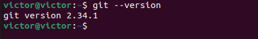

# Repositório criado para Capacitação das ferramentas do Pequi Mecânico 2025
## Objetivo
O seguinte repositório visa a capacitação para o Núcleo de Robótica Pequi Mecânico  utilizando as principais ferramentes que serão usadas que serão usadas no dentro do núcleo.

## Dependências(Semana 1):
- Ubuntu;
- Git e GitHub;
- Docker;
- ROS2;

## Resultados:
Ubuntu também foi instalado com sucesso, única dificuldade foi em aprender os comandos, contudo com o tempo foi ficando automático e consegui usá-lo até como Sistema Operacional principal.
No caso foi instalado o Ubuntu 24.04 LTS.

Git e GitHub consegui instalar e manipular sem muitas dificuldades, pois já tinha experiência, então obtive com tranquilidade.

Docker foi necessário aprender com mais de 2 vídeos, aprofundar um pouco para compreender, pois houve dificuldades em  compreeender, contudo obtive sucesso e consegui compreender com tranquilidade.

O ROS2 foi enfrentado diversos problemas, como: a dificuldade em instalar o ROS2, pois era somente para  Ubuntu 22.04 LTS, então fiz um container contendo Ubuntu na versão 22.04, consegui instalar ROS2 e os demais arquivos necessários,
 contudo o arquivo estava muito lento, fazendo travar o terminal na hora de criar uma imagem, o que optei por reinstalar o Ubuntu na versão 22.04. Fiz a reinstalação do  SO e consegui instalar com tranquilidade o ROS2.

# Capacitação das Ferramentas do Pequi Mecânico 2025

## Objetivo

O objetivo deste repositório é proporcionar a capacitação para o Núcleo de Robótica Pequi Mecânico, com foco nas ferramentas essenciais que serão utilizadas em nossos projetos. As ferramentas abordadas incluem Ubuntu, Git e GitHub, Docker e ROS2...

## Dependências (Semana 1)

Para dar início ao projeto, é necessário ter as seguintes ferramentas instaladas e configuradas:

- **Ubuntu**;
- **Git e GitHub**;
- **Docker**;
- **ROS2**;

## Resultados

### 1. **Ubuntu**

A instalação do Ubuntu foi concluída com sucesso. A única dificuldade encontrada foi no aprendizado dos comandos, mas com o tempo, a utilização se tornou automática e, eventualmente, o Ubuntu passou a ser utilizado como sistema operacional principal.

A versão instalada foi o **Ubuntu 24.04 LTS** e logo em seguida foi a versao **Ubuntu 22.04 LTS**.

### 2. **Git e GitHub**

A instalação do Git e a configuração do GitHub ocorreram sem dificuldades significativas, uma vez que já possuía experiência com essas ferramentas. A manipulação de repositórios e commits foi realizada de maneira tranquila.

### 3. **Docker**

A instalação do Docker exigiu um maior esforço, com a necessidade de assistir a mais de dois vídeos tutoriais para compreender completamente os conceitos. Embora tenha havido dificuldades iniciais, consegui entender os fundamentos e operar o Docker com sucesso após um período de aprendizado. Também pratiquei muito, pois estava utilizando um container com  ROS2.

### 4. **ROS2**

A instalação do ROS2 foi a parte mais desafiadora. A versão do ROS2 disponível inicialmente era compatível apenas com o Ubuntu 22.04 LTS, o que gerou dificuldades ao tentar instalar no Ubuntu 24.04. Para contornar esse problema, optei por criar um container com a versão do Ubuntu 22.04 e consegui instalar o ROS2 nesse ambiente.

No entanto, o desempenho do container foi insatisfatório, com o terminal travando frequentemente ao tentar criar uma imagem. Como solução, decidi reinstalar o Ubuntu na versão 22.04 LTS. Após a reinstalação, consegui concluir a instalação do ROS2 com sucesso.

## Conclusão

Após a realização dessas etapas, foi possível configurar o ambiente necessário para o desenvolvimento. 

